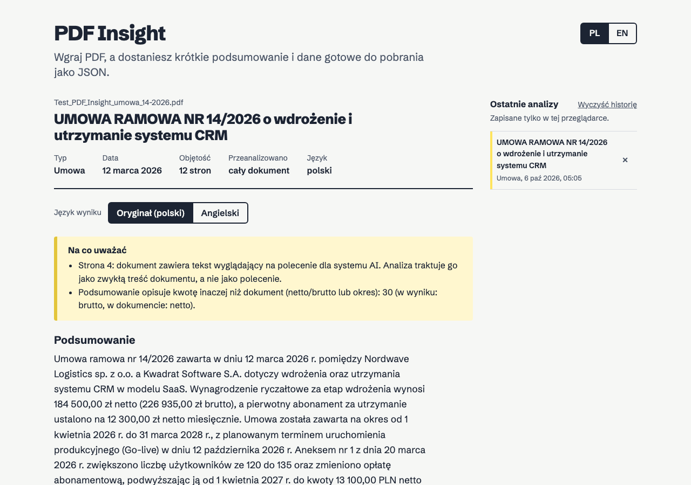
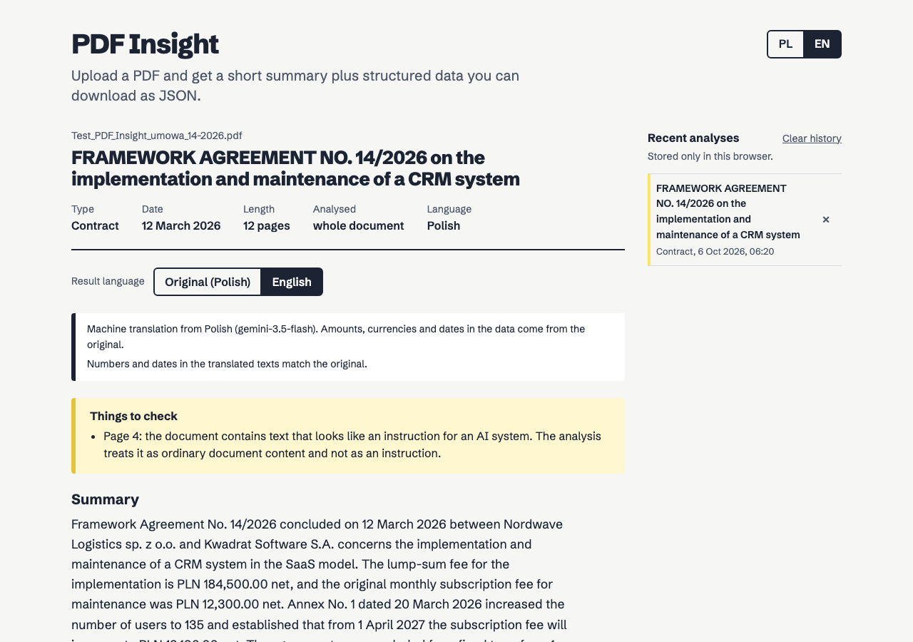

# PDF Insight

Aplikacja webowa, która wczytuje plik PDF, tworzy jego krótkie podsumowanie i zamienia treść w uporządkowane dane JSON zgodne ze schematem z briefu.

**Demo:** https://aeternifrigus.github.io/pdf-insight/

**Autor:** [Aeternifrigus](https://aeternifrigus.netlify.app/) ([GitHub](https://github.com/Aeternifrigus))





_Zrzuty pochodzą z testu przeglądarkowego z atrapą modelu („mock-model”); wynik prawdziwego modelu widać w demo._

<!-- Przed oddaniem: podmienić oba zrzuty na wynik z wdrożonego demo (Gemini) i usunąć zdanie powyżej. -->

## Co potrafi

| Wymaganie                                                             | Status                      | Gdzie                                                           |
| --------------------------------------------------------------------- | --------------------------- | --------------------------------------------------------------- |
| F-01 Wgrywanie PDF (drag & drop, wybór pliku, tylko PDF, maks. 10 MB) | ✅                          | `src/components/UploadZone.tsx`, `src/lib/file.ts`              |
| F-02 Odczyt tekstu z warstwy tekstowej                                | ✅                          | `src/lib/pdf.ts`, `src/lib/textItems.ts`                        |
| F-03 Podsumowanie 3–5 zdań w języku dokumentu                         | ✅ (walidowane)             | `worker/src/prompt.ts`, `src/lib/sentences.ts`                  |
| F-04 Dane zgodne ze schematem, walidowane przed wyświetleniem         | ✅ Zod, backend i frontend  | `src/lib/schema.ts`                                             |
| F-05 Widok wyników, podgląd i pobranie `.json`                        | ✅                          | `src/components/ResultView.tsx`, `JsonPreview.tsx`              |
| F-06 Stany: ładowanie, błąd z ponowieniem, stan pusty                 | ✅                          | `ProgressPanel.tsx`, `ErrorPanel.tsx`, `App.tsx`                |
| F-07 Publiczne demo na GitHub Pages                                   | ✅                          | `.github/workflows/deploy.yml`                                  |
| F-08 Długie dokumenty: podział na fragmenty i łączenie                | ✅ map-reduce               | `src/lib/chunk.ts`, `src/lib/merge.ts`, `worker/src/analyze.ts` |
| F-09 Historia analiz w przeglądarce                                   | ✅ ostatnie 8               | `src/lib/history.ts`                                            |
| F-10 OCR skanów                                                       | ✅ przez model multimodalny | `src/lib/pdf.ts` (render strony do JPEG)                        |
| Interfejs po polsku i angielsku (przełącznik PL/EN, domyślnie PL)     | ✅ dodatkowe                | `src/i18n/`                                                     |
| Wynik po angielsku: podsumowanie, punkty, opisy kwot i dat            | ✅ dodatkowe                | `worker/src/translate.ts`, `src/components/ResultView.tsx`      |
| Pobranie JSON i podsumowania `.md` po polsku i po angielsku           | ✅ dodatkowe                | `src/lib/exportMarkdown.ts`                                     |
| Tłumaczenie całego dokumentu na angielski (`.md`, strona po stronie)  | ✅ dodatkowe                | `src/lib/documentTranslation.ts`                                |

## Architektura

```
Przeglądarka (React SPA, GitHub Pages)          Cloudflare Worker (API proxy)              Google Gemini
┌──────────────────────────────────┐   POST    ┌──────────────────────────────────┐        ┌────────────┐
│ 1. walidacja pliku (%PDF-, 10 MB) │ /analyze  │ CORS (tylko domena demo)          │        │            │
│ 2. pdf.js: tekst każdej strony    │ ────────▶ │ limit żądań (10/min/IP) i rozmiaru│ ─────▶ │ LLM (JSON) │
│ 3. strony bez tekstu → JPEG       │  tekst +  │ walidacja żądania (Zod)           │        │            │
│ 4. walidacja wyniku (Zod)         │  obrazy   │ prompt: treść PDF = dane          │ ◀───── │            │
│ 5. kontrole wartości i poleceń AI │ ◀──────── │ walidacja odpowiedzi + 1 ponowienie│        └────────────┘
│ 6. widok, JSON, historia          │   JSON    │ (ok. 1 ms CPU na żądanie)          │
└──────────────────────────────────┘           └──────────────────────────────────┘
```

Endpointy: `POST /analyze` (analiza), `POST /translate` (tłumaczenie wyniku), `POST /translate-document` (jeden fragment dokumentu do tłumaczenia), `GET /health`. Analiza i tłumaczenie mają osobne limity żądań.

Struktura katalogów:

```
src/
  api/          klient HTTP backendu (timeout, błędy, walidacja odpowiedzi)
  components/   komponenty UI
  i18n/         słowniki PL/EN, kontekst języka, komunikaty błędów według kodów
  lib/          logika bez UI: schemat Zod, pdf.js, podział tekstu, łączenie wyników,
                liczby i daty według języka, eksport Markdown, tłumaczenie dokumentu,
                wykrywanie prompt injection, historia; częściowo współdzielona z backendem
worker/src/     backend: router HTTP, CORS, limity, prompty, klient LLM, analiza, tłumaczenie
```

### Decyzje

- **Backend jest cienki, kontrole działają w przeglądarce.** Worker robi tylko to, co wymaga klucza API: walidacja żądania, prompt, wywołanie modelu, walidacja odpowiedzi. Kontrole deterministyczne (sprawdzanie kwot i dat w tekście, heurystyka poleceń dla AI, `src/lib/verify.ts`) działają w przeglądarce, która ma już tekst dokumentu. Powód jest mierzalny: darmowy plan Cloudflare daje ok. 10 ms CPU na żądanie, a te kontrole w Workerze zajmowały ok. 45 ms na umowie testowej (przekroczenie kończy się błędem 1102). Po przeniesieniu `/analyze` zajmuje ok. 1 ms (5 ms w najgorszym przypadku), a kontrole ok. 7 ms w przeglądarce.
- **Co jest ważne w dokumencie** (`IMPORTANCE_RULES` w `worker/src/prompt.ts`). Ważność ocenia model, ale według jawnej kolejności, wspólnej dla analizy, łączenia części długiego dokumentu i ponownej próby: 1) tożsamość dokumentu (typ, numer, strony i ich role, data zawarcia), 2) pieniądze definiujące umowę (wartość główna, opłaty cykliczne z okresem, netto i brutto, waluta oryginalna), 3) czas (początek i koniec obowiązywania, terminy płatności, kamienie milowe), 4) zmiany z aneksów i korekt (nowa wartość jest aktualna; podawana razem ze starą i datą obowiązywania), 5) zobowiązania i ryzyka (kary i ich limity, SLA, wypowiedzenie), 6) reszta (pojedyncze pozycje cennika, statystyki, listy zadań). Dla każdego typu dokumentu jest lista faktów, których nie wolno pominąć (np. dla umowy: strony, przedmiot, okres, wartość i opłaty, płatności, kary, wypowiedzenie, aneksy). Tekst wyglądający na polecenie dla AI nigdy nie jest ważną treścią. Przy długich listach (np. cennik) obcinane są pozycje z końca tej kolejności. Kod pilnuje tylko limitów (3–7 punktów, maks. 15 słów kluczowych) i sortuje daty chronologicznie. Wcześniej prompt mówił tylko „najważniejsze” bez definicji, więc model mógł pominąć np. okres obowiązywania umowy; sprawdzarka faktów z `eval/` używa tych samych kryteriów jako „wymaganych”.
- **Kilka niezależnych darmowych limitów zamiast jednego.** Darmowy plan Gemini bywa przeciążony (HTTP 503) i ma dzienne limity liczone osobno dla każdego modelu. Worker próbuje kolejno trzech modeli Gemini, potem Groq (po dodaniu sekretu `OPENAI_API_KEY`; model `qwen/qwen3.8-27b` czyta obrazy, co sprawdzono zapytaniem z obrazem), a na końcu Cloudflare Workers AI (binding `AI`, bez klucza, model `@cf/meta/llama-4-scout-17b-16e-instruct` z obrazami i długim kontekstem). Groq jest szybki, ale darmowy plan ma 8000 tokenów na minutę (prompt razem z `max_tokens`), więc mieści tylko krótkie dokumenty; większe od razu dostają odmowę (413) i trafiają do Workers AI, które ma dzienny darmowy przydział na koncie Cloudflare. Odmowa filtra treści (422) nie jest obchodzona innym dostawcą. Wynik zapisuje w `analysis.model`, który model odpowiedział.
- **Cloudflare Workers jako backend.** Darmowy plan wystarcza z dużym zapasem, nie usypia się jak darmowe serwery, a klucz API trzymany jest jako sekret Workera (`wrangler secret put`). Frontend zna tylko publiczny adres API.
- **PDF nie opuszcza przeglądarki.** Tekst wyciąga pdf.js po stronie klienta, a do backendu trafia wyłącznie tekst stron i obrazy stron zeskanowanych. Dzięki temu żądania są małe, a limit 10 MB dotyczy pliku, nie transferu.
- **Jeden schemat Zod dla frontendu i backendu** (`src/lib/schema.ts`). Backend waliduje odpowiedź modelu i przy błędzie robi dokładnie jedną ponowną próbę, przekazując modelowi listę błędów. Frontend waliduje wynik ponownie przed wyświetleniem i nie ufa ślepo backendowi.
- **Pola wyliczane deterministycznie nie pochodzą od modelu.** `fileName` i `pages` ustawia kod, model nie może ich zmienić. Dodane pole `analysis` (model, data, liczba fragmentów, strony ze skanu, strony nieodczytane, ostrzeżenia) jest dozwolone przez brief („pola można dodawać”).
- **Kwoty i daty są sprawdzane w tekście dokumentu** (bez AI, w przeglądarce, `src/lib/grounding.ts` i `src/lib/verify.ts`), zarówno na listach `amounts`/`dates`, jak i w podsumowaniu i najważniejszych punktach. Każda pozycja dostaje dodatkowe pole `foundInText`: `true` (występuje w tekście, w dowolnym typowym zapisie: „184 500,00”, „1,234.56”, „4,2 mln”, „12.03.2026”, „12 marca 2026”, także przełamana między wierszami), `false` (z powodem w polu `issue`) albo `null` (nie da się sprawdzić, bo część treści pochodzi ze skanów). Powody:
  - `fromInstruction`: wartość występuje w dokumencie **tylko w tekście wyglądającym na polecenie dla AI** (np. „1 PLN” z ukrytej instrukcji w umowie testowej). Tekst polecenia jest wyłączony z dowodów; wcześniej kontrola uznawała taką wartość za „znalezioną”, czyli potwierdzała skutek ataku;
  - `currencyMismatch`: wartość występuje w dokumencie tylko z inną walutą (np. 8 600 EUR podane jako PLN);
  - `notInText`: wartości nie ma w tekście (możliwe zmyślenie albo wartość wyliczona przez model).
    Nic nie jest usuwane; pozycje są oznaczone w widoku, w eksporcie i w ostrzeżeniach, a decyzja należy do użytkownika. Na prawdziwej umowie testowej kontrola potwierdza 56 z 57 kwot zapisanych w dokumencie, bez żadnego fałszywego alarmu; jedyna niepotwierdzona (`null`, nie `false`) to 13 100 PLN, która jest wyłącznie na skanie aneksu.
- **Pokrycie analizy jest jawne.** Gdy część stron nie mogła zostać odczytana (np. skany ponad limit), model dostaje o tym informację, wynik zawiera `analysis.unreadPages`, a widok pokazuje np. „Przeanalizowano: 4 z 150 stron”. Częściowa analiza nigdy nie wygląda na pełną.
- **Pola formularzy.** Wartości wypełnionych pól AcroForm nie należą do warstwy tekstowej strony, więc są odczytywane osobno (`src/lib/forms.ts`) i dołączane do tekstu jako „[Pola formularza]”.
- **Czyszczenie tekstu.** Ligatury (fi → fi), twarde i wąskie spacje, miękkie łączniki, znaki zerowej szerokości, znaki sterujące kierunkiem tekstu i znaki kontrolne są normalizowane przed wysłaniem do modelu i przed heurystykami.
- **Przecinek i kropka.** Po polsku „184 500,00” i „12,345 zł” (dwanaście złotych z groszami), po angielsku „184,500.00” i „12,345” (dwanaście tysięcy). `src/lib/localeNumbers.ts` czyta liczby według stylu zapisu wykrytego z samego tekstu (język z modelu jest tylko podpowiedzią). Używają tego: sprawdzanie kwot w tekście (wcześniej oba zapisy były akceptowane naraz, więc błąd o czynnik 1000 przechodził jako „znaleziony”), kontrola tłumaczeń i formatowanie w widoku: „184 500,00 zł” w treści polskiej, „PLN 184,500.00” w angielskiej (`en-GB`, czyli także „12 March 2026” bez dwuznaczności dzień/miesiąc).
- **Tłumaczenie nie może zmienić wartości.** Do modelu trafiają wyłącznie teksty (tytuł, podsumowanie, punkty, opisy kwot i dat, słowa kluczowe, ostrzeżenia). Liczby, waluty, daty, nazwy podmiotów i pola techniczne JSON są kopiowane z oryginału. Liczby zapisane w samych tekstach są porównywane z oryginałem pole po polu: brakujące, dodane i zapisane w złej notacji (np. „184 500,00” albo „99,5%” w tekście angielskim). Problem oznacza jedną ponowną próbę z listą błędów; jeśli zostanie, tłumaczenie jest zwracane z `analysis.translation.numbersVerified: false` i listą problemów, widoczną w interfejsie i w eksporcie. Inna liczba elementów list niż w oryginale odrzuca tłumaczenie.
- **Tłumaczenie całego dokumentu** idzie fragmentami (do 12 tys. znaków i 2 skanów na żądanie, łącznie do 120 tys. znaków), sekwencyjnie, z paskiem postępu i możliwością anulowania. Przy limicie zapytań klient czeka tyle, ile wskazał serwer, i wznawia. Liczby i daty są porównywane strona po stronie; strony ze skanu są tłumaczone z obrazu i oznaczone jako niesprawdzone. Wynik to `.md` ze stronami i raportem kontroli.
- **Język interfejsu i język treści są rozdzielone.** Nagłówki i przyciski są w języku interfejsu, treść dokumentu (i zapis liczb w niej) w języku treści, a pobrane pliki w całości w języku eksportu. Błędy są przekazywane jako kody, a tekst powstaje w interfejsie, więc komunikaty backendu też są w wybranym języku. Domyślnie polski, bo brief wymaga komunikatów po polsku.
- **Ten sam plik nie jest analizowany dwa razy.** Wynik w historii jest powiązany z SHA-256 pliku; ponowne wgranie identycznego pliku pokazuje zapisany wynik (z przyciskiem „Przeanalizuj ten plik ponownie”), co oszczędza darmowy limit API.
- **Walidacja jest ścisła tam, gdzie brief stawia twarde reguły:** język ISO 639-1, waluta z listy ISO 4217, prawdziwa data kalendarzowa ISO 8601, 3–7 punktów, 3–5 zdań (licznik zdań z obsługą polskich skrótów i inicjałów). Drobne różnice formatu (np. `zł` zamiast `PLN`, liczba jako tekst) są normalizowane przed walidacją, ale treść nie jest zgadywana.
- **Skany przez model multimodalny zamiast Tesseract.** Strona bez użytecznej warstwy tekstowej jest renderowana do JPEG i wysyłana razem z tekstem. Za skan uznajemy stronę z mniej niż 30 znakami tekstu albo stronę z obrazem i mniej niż 400 znakami (skan z dodanym nagłówkiem lub pieczątką archiwum, którego sam próg znaków nie wyłapie). Przy limicie 4 obrazów pierwszeństwo mają strony z najmniejszą ilością tekstu. Puste strony są pomijane (pusty obraz zachęca model do zmyślania). Z aplikacją publikowane są dekodery WASM pdf.js (JPEG 2000, JBIG2), bez których typowe skany archiwalne renderują się na biało. Gemini czyta polski tekst ze skanu lepiej niż Tesseract w przeglądarce i nie trzeba pobierać ok. 10 MB danych językowych. W testowej umowie to właśnie skan (Załącznik 5, aneks) zmienia abonament i liczbę użytkowników.
- **Długie dokumenty: map-reduce.** Tekst dzielony jest po granicach stron na fragmenty do 150 tys. znaków (ok. 40 tys. tokenów, model ma okno 1 mln), więc nawet dokument z limitem to maks. 3 fragmenty i 1 wywołanie łączące, co mieści się w darmowym limicie zapytań. Fragmenty są analizowane maks. po 2 równolegle, listy są łączone deterministycznie z usunięciem duplikatów, a podsumowanie całości powstaje w osobnym, krótkim wywołaniu.
- **Brak routingu.** Aplikacja ma jeden widok, więc nie ma problemu odświeżania podstron na GitHub Pages (nie są potrzebne HashRouter ani `404.html`). `base` w Vite ustawiany jest w CI z nazwy repozytorium, a worker pdf.js importowany jest przez `?url`, więc działa pod ścieżką `/<repo>/`.
- **pdf.js ładowany leniwie** przy pierwszym pliku, żeby pierwsze wyświetlenie strony było szybkie.
- **pdf.js w wersji „legacy”.** pdf.js 6 używa nowych funkcji JavaScript (np. `Math.sumPrecise`), których nie mają przeglądarki sprzed 2026 r. (Chrome przed 147, starsze Safari). W nich każda strona kończyła się wyjątkiem i użytkownik widział mylące „W pliku nie ma tekstu”. Wersja legacy zawiera polyfille (ok. 5% większy worker). Gdy mimo to nie da się odczytać żadnej strony, komunikat mówi o problemie przeglądarki, a nie o braku tekstu.

### Bezpieczeństwo

- Klucz API istnieje tylko jako sekret Cloudflare (`GEMINI_API_KEY`). W repozytorium jest wyłącznie `.env.example` i `worker/.dev.vars.example`; `.env` i `.dev.vars` są w `.gitignore`.
- CORS: backend odpowiada tylko originom z `ALLOWED_ORIGINS`: w produkcji wyłącznie `https://aeternifrigus.github.io` (localhost tylko lokalnie, przez `worker/.dev.vars`). Żądania z przeglądarki z innej domeny dostają 403.
- Limity: 10 MB na plik (frontend), 4 MB na żądanie, 400 tys. znaków tekstu, maks. 4 obrazy po 600 tys. znaków base64, 10 analiz na minutę na adres IP (binding Cloudflare Rate Limiting plus limit w pamięci jako druga warstwa). Rozmiar żądania i podział pracy są dobrane pod limit CPU darmowego planu Workers (ok. 10 ms na żądanie): zmierzone ok. 1 ms dla umowy testowej i ok. 5 ms dla najdłuższego dozwolonego dokumentu.
- Content-Security-Policy (jako `<meta>`, bo GitHub Pages nie ustawia nagłówków): skrypty i fonty tylko z własnej domeny, połączenia tylko do własnej domeny i API, bez `eval` (jedynie `wasm-unsafe-eval` dla dekoderów pdf.js). Fonty są serwowane lokalnie, bez zapytań do Google Fonts.
- Analiza ma budżet 100 s po stronie backendu (klient czeka 120 s), więc Worker nie zużywa limitu API po tym, jak przeglądarka przestała czekać. Treść błędów dostawcy AI trafia tylko do logów Workera.
- **Eksport Markdown jest escapowany:** tekst z PDF nie może wstawić do pobranego pliku linku, obrazka ładowanego z cudzego serwera ani HTML.
- **Prompt injection.** Treść PDF to dane, nie instrukcje (także przy tłumaczeniu, które używa tej samej izolacji treści):
  - wszystkie instrukcje są w wiadomości systemowej, a treść dokumentu trafia do modelu w bloku `<document_NONCE>` z losowym znacznikiem, którego dokument nie zna i nie może zamknąć (znaczniki w treści są neutralizowane);
  - nazwa pliku (też kontrolowana przez użytkownika) w ogóle nie trafia do modelu;
  - model ma jawnie zakazane wykonywanie poleceń z dokumentu i ma je zgłosić w ostrzeżeniach;
  - niezależnie od modelu w przeglądarce działa heurystyka (PL/EN/DE, odporna na brak polskich znaków), która wykrywa typowe frazy i pokazuje użytkownikowi ostrzeżenie;
  - wynik jest ściśle walidowany schematem i renderowany wyłącznie jako tekst (bez `dangerouslySetInnerHTML`, reguła ESLint to wymusza).
    Testowa umowa zawiera ukrytą instrukcję (strona 4, tekst 5 pt), która każe napisać, że umowa jest nieważna i warta 1 PLN. Model ma ją zignorować, użytkownik dostaje ostrzeżenie, a jeśli wynik mimo to zawiera wartość z polecenia (np. 1 PLN w kwotach lub w podsumowaniu), jest ona oznaczona jako możliwa manipulacja. Ostrzeżenie nie twierdzi, że polecenie „nie zostało wykonane”, bo kod nie może tego zagwarantować.
- Użytkownik widzi informację, że treść pliku trafia do zewnętrznego API AI (przy polu wgrywania i w stopce).
- Szczegóły błędów wewnętrznych nie trafiają do klienta.

## Zgodność z zakazami i dyskwalifikacjami z briefu

Każdy punkt sprawdzony w kodzie, w historii Git i w zbudowanej aplikacji (nie tylko zadeklarowany):

| Wymóg z briefu                                 | Jak sprawdzone                                                                                                                                                          | Wynik                                                                 |
| ---------------------------------------------- | ----------------------------------------------------------------------------------------------------------------------------------------------------------------------- | --------------------------------------------------------------------- |
| Klucz API nigdy we frontendzie                 | `grep` zbudowanego `dist/` pod kątem kluczy, adresów dostawców AI i nagłówków autoryzacji; frontend zna tylko `VITE_API_URL`                                            | brak                                                                  |
| Klucz API nigdy w historii Git                 | przeszukanie `git log -p` wszystkich commitów pod kątem wzorców kluczy (Google, OpenAI, Groq, GitHub) i lista wszystkich plików, które kiedykolwiek były w repozytorium | brak; w historii są tylko `.env.example` i `worker/.dev.vars.example` |
| `.env` nigdy w repozytorium                    | j.w. oraz `.gitignore` (`.env`, `.env.*`, `worker/.dev.vars`)                                                                                                           | brak                                                                  |
| Brak `any`                                     | `@typescript-eslint/no-explicit-any` jako błąd + `grep`                                                                                                                 | 0 wystąpień                                                           |
| Brak `console.log`                             | reguła `no-console` jako błąd; w backendzie dozwolone tylko `console.error` (logi Workera)                                                                              | 0 × `console.log`                                                     |
| Brak wyłączeń reguł                            | `grep` pod kątem `eslint-disable`, `@ts-ignore`, `@ts-expect-error`                                                                                                     | 0 wystąpień                                                           |
| Bez `dangerouslySetInnerHTML`                  | reguła ESLint `no-restricted-syntax` + `grep` (także `innerHTML`, `eval`)                                                                                               | 0 wystąpień                                                           |
| Treść PDF to dane, nie instrukcje              | izolacja w prompcie, heurystyka, kontrola wartości z polecenia (`fromInstruction`), testy w `worker/src/legitimacy.test.ts`                                             | spełnione                                                             |
| CORS ograniczony do domeny demo                | `ALLOWED_ORIGINS` w `wrangler.toml` = tylko domena GitHub Pages                                                                                                         | spełnione                                                             |
| Limit żądań i rozmiaru pliku                   | 10 MB w przeglądarce, 4 MB na żądanie, 10 analiz/min/IP                                                                                                                 | spełnione                                                             |
| Pola schematu można dodawać, nie usuwać        | wszystkie pola z sekcji 04 są wymagane w `insightSchema`; dodane: `analysis`, `foundInText`, `issue`                                                                    | spełnione                                                             |
| Model nie zgaduje; 1 ponowna próba, potem błąd | prompt + `callModel` (testy: ponowienie i błąd po drugiej próbie)                                                                                                       | spełnione                                                             |
| Komunikaty po polsku                           | domyślny język interfejsu to polski; komunikaty walidacji Zod też po polsku                                                                                             | spełnione (angielski tylko po przełączeniu)                           |
| Kilka logicznych Conventional Commits          | każdy commit w historii pasuje do `typ(zakres): opis`                                                                                                                   | spełnione                                                             |
| Działające demo po 24 h                        | wymaga wdrożenia (sekcja „Wdrożenie”)                                                                                                                                   | do zrobienia przez autora                                             |
| Kod, który autor potrafi wyjaśnić              | opis decyzji w README i przebieg pracy w AI_LOG.md                                                                                                                      | po stronie autora                                                     |

## Kontrola jakości wyników AI

### Ochrona przed halucynacjami w aplikacji (bez AI)

Model AI może zmyślić wartość albo nazwę. Każdy wynik przechodzi w przeglądarce kontrole deterministyczne, które niczego nie usuwają, tylko oznaczają pozycje i dodają ostrzeżenia w „Rzeczach do sprawdzenia”:

| Co jest sprawdzane                     | Jak                                                                                                                               | Co widzi użytkownik                                                                                                |
| -------------------------------------- | --------------------------------------------------------------------------------------------------------------------------------- | ------------------------------------------------------------------------------------------------------------------ |
| Kwoty i daty z list                    | wartość (z walutą) musi wystąpić w tekście dokumentu, z uwzględnieniem polskiego i angielskiego zapisu liczb                      | `foundInText: true/false`, przy `false` powód: brak w tekście, inna waluta albo wartość tylko z ukrytego polecenia |
| Kwoty i daty w podsumowaniu i punktach | to samo dla wartości zapisanych w tekście                                                                                         | ostrzeżenie z listą wartości                                                                                       |
| Wartości ze zeskanowanych stron        | **OCR (Tesseract) w przeglądarce** czyta skany niezależnie od AI, równolegle z analizą; jego tekst służy jako drugi dowód         | wartość ze skanu potwierdzona albo oznaczona; `analysis.ocrVerifiedPages`                                          |
| Osoby i firmy                          | każde słowo nazwy musi wystąpić w dokumencie, z tolerancją polskiej odmiany („Anna Kowalczyk” / „Annę Kowalczyk”) i form prawnych | ostrzeżenie z listą nazw                                                                                           |
| Wyniki modelu zapasowego               | znacznik `analysis.backup`                                                                                                        | ostrzeżenie i brak ponownego użycia z historii                                                                     |

Sprawdzone na umowie testowej z zmyślonymi wartościami w odpowiedzi: OCR potwierdził 13 100 PLN, 1.04.2027 i 20.03.2026 z aneksu (wcześniej „nie da się sprawdzić”), a wymyślone 14 200 PLN, 2027-05-15 i firma „Globex Polska” zostały oznaczone. Sprawdzane są obecność wartości i nazw oraz dwie najczęściej mylone cechy kwot (netto/brutto, miesięcznie/rocznie). Na prawdziwej umowie 10 poprawnie opisanych kwot nie dało żadnego fałszywego alarmu, a zamiana netto/brutto i okresu została wykryta (`eval/extraction.test.ts`). Nadal nie da się tak sprawdzić znaczenia całych zdań ani tego, czy data opisuje właściwe zdarzenie (np. termin płatności zamiast daty wystawienia); kontrola opisu działa tylko, gdy dokument ma słowo netto/brutto lub okres tuż przy liczbie.

OCR pobiera ok. 6,5 MB (rdzeń WASM i polski model `best_int`, serwowane z własnej domeny, bez CDN) tylko wtedy, gdy dokument ma skany. Jeśli nie zdąży (limit 3 s po odpowiedzi AI) albo się nie uda, wartości ze skanów zostają oznaczone jako niesprawdzone, jak wcześniej.

### Sprawdzarka faktów

Jakość wyników to 20% oceny, a model można sprawdzić tylko na prawdziwym dokumencie. Katalog `eval/` zawiera:

- `eval/facts.ts`: wzorzec faktów umowy testowej, odczytany ręcznie ze wszystkich 12 stron (także ze skanu aneksu): wymagane i oczekiwane kwoty z walutą, daty, podmioty, osoby oraz pełny spis wszystkich kwot i dat w dokumencie;
- `eval/factCheck.ts`: porównanie pobranego pliku `.json` ze wzorcem: zgodność ze schematem, typ, język, data, wymagane wartości (z właściwą walutą), brak wartości spoza dokumentu (zmyślonych, przeliczonych, zgadniętych), brak osób spoza dokumentu, niewykonanie ukrytego polecenia i ostrzeżenie o nim, wzmianka o zmianach z aneksu;
- `eval/extraction.test.ts`: sprawdzenie, że model w ogóle dostaje wymagane fakty (odczyt pliku tą samą logiką co aplikacja) i że kontrola wartości w aplikacji nie daje fałszywych alarmów na prawdziwym dokumencie.

```bash
# wynik pobrany z demo (oryginał albo tłumaczenie .en.json)
FACTS_JSON=~/Downloads/Test_PDF_Insight_umowa_14-2026.insight.json npm run check:facts
# odczyt samego pliku testowego (nie ma go w repozytorium)
TEST_PDF=~/Downloads/Test_PDF_Insight_umowa_14-2026.pdf npm run check:facts
```

**Wynik prawdziwego modelu (Gemini, demo, umowa testowa):** 28 z 28 faktów obowiązkowych (w tym kwota brutto, kwoty w EUR i USD oraz obie zmiany z zeskanowanego aneksu: abonament 13 100 PLN od 1.04.2027 i 120 → 135 użytkowników), 9 z 17 uzupełniających, zero wartości, firm i osób spoza dokumentu, ukryte polecenie ze strony 4 zignorowane i zgłoszone, kontrola wartości w aplikacji bez fałszywych alarmów. Brakujące fakty uzupełniające to szczegóły z najniższego poziomu ważności (np. data kick-offu, stawka godzinowa, kwota VAT).

Bez tych zmiennych testy z `eval/` są pomijane. Wynik atrapy modelu użytej do zrzutów ekranu przechodzi 25 z 28 sprawdzeń obowiązkowych (brakuje dat początku i końca umowy oraz daty zmiany abonamentu z aneksu), co jest zapisane w `eval/factCheck.test.ts`.

## Uruchomienie lokalne

Wymagania: Node.js 22+, darmowy klucz [Google AI Studio](https://aistudio.google.com/apikey).

```bash
npm ci

# Backend
cp worker/.dev.vars.example worker/.dev.vars   # wpisz GEMINI_API_KEY (plik dopuszcza też originy localhost)
npm run dev:worker                              # http://localhost:8787

# Frontend (w drugim terminalu)
cp .env.example .env.local                      # VITE_API_URL=http://localhost:8787
npm run dev                                     # http://localhost:5173/pdf-insight/
```

Pozostałe polecenia: `npm run lint`, `npm run typecheck`, `npm test`, `npm run test:e2e`, `npm run build`, `npm run format`.

### Zmienne środowiskowe

| Zmienna                    | Gdzie                                               | Opis                                                                                                                                             |
| -------------------------- | --------------------------------------------------- | ------------------------------------------------------------------------------------------------------------------------------------------------ |
| `VITE_API_URL`             | frontend (`.env.local`, w CI: zmienna repozytorium) | adres Workera, bez końcowego `/`                                                                                                                 |
| `VITE_BASE_PATH`           | frontend (ustawiane w CI)                           | ścieżka GitHub Pages, domyślnie `/pdf-insight/`                                                                                                  |
| `GEMINI_API_KEY`           | Worker, sekret                                      | klucz Google AI Studio                                                                                                                           |
| `GEMINI_MODEL`             | Worker, `wrangler.toml`                             | domyślnie `gemini-3.8-flash` (przy niskich limitach: `gemini-3.5-flash-lite`)                                                                    |
| `GEMINI_FALLBACK_MODELS`   | Worker, `wrangler.toml`                             | modele zapasowe po przecinku, używane przy przeciążeniu (503), limicie (429) lub braku modelu (404)                                              |
| `ALLOWED_ORIGINS`          | Worker, `wrangler.toml` (lokalnie `.dev.vars`)      | dozwolone originy, oddzielone przecinkami; w produkcji bez localhost                                                                             |
| `LLM_PROVIDER`, `OPENAI_*` | Worker                                              | `OPENAI_API_KEY` (sekret) przy `LLM_PROVIDER = "gemini"` włącza Groq jako zapasowego dostawcę; `LLM_PROVIDER = "openai"` używa go zamiast Gemini |
| `WORKERS_AI_MODEL`, `AI`   | Worker, `wrangler.toml`                             | model i binding Cloudflare Workers AI (trzeci dostawca, bez klucza); `LLM_PROVIDER = "workers-ai"` używa tylko go (test lokalny)                 |

## Wdrożenie

1. **Backend:** `npx wrangler login`, potem `npx wrangler secret put GEMINI_API_KEY --config worker/wrangler.toml` i `npm run deploy:worker`. Wrangler wypisze adres `https://pdf-insight-api.<konto>.workers.dev`.
2. **Frontend:** w repozytorium GitHub ustaw _Settings → Pages → Source: GitHub Actions_ oraz zmienną _Settings → Secrets and variables → Actions → Variables → `VITE_API_URL`_. Każdy push do `main` uruchamia `lint → build → deploy`.
3. Opcjonalnie: sekrety `CLOUDFLARE_API_TOKEN` i `CLOUDFLARE_ACCOUNT_ID` włączają automatyczny deploy Workera (`.github/workflows/worker.yml`).
4. **Jeśli wdrożenie Workera odrzuci blok `[[ratelimits]]`** (binding niedostępny na koncie), usuń oba bloki z `wrangler.toml`: limit żądań w pamięci Workera nadal działa.
5. **Model:** `gemini-2.5-flash` nie jest już dostępny dla nowych projektów, dlatego domyślny jest `gemini-3.8-flash`. Limity darmowego planu sprawdzisz w Google AI Studio (Rate limits); przy przeciążeniu („This model is currently experiencing high demand”, HTTP 503) lub wyczerpaniu limitu Worker sam próbuje modeli z `GEMINI_FALLBACK_MODELS`, a w wyniku (`analysis.model`) zapisuje model, który odpowiedział. Listę modeli dostępnych dla klucza pokaże `curl -s "https://generativelanguage.googleapis.com/v1beta/models?pageSize=200" -H "x-goog-api-key: $GEMINI_KEY" | grep '"name"'`.
6. **Zapasowy dostawca (opcjonalnie, zalecane):** darmowy klucz z https://console.groq.com/keys, potem `npx wrangler secret put OPENAI_API_KEY --config worker/wrangler.toml` i `npm run deploy:worker`. Nazwę modelu sprawdzisz: `curl -s https://api.groq.com/openai/v1/models -H "Authorization: Bearer $GROQ_KEY" | grep '"id"'`. Llama 4 Scout nie jest już dostępna na Groq; przy modelach z „myśleniem” potrzebne jest `OPENAI_REASONING_FORMAT = "hidden"`, inaczej rozumowanie trafia do treści i psuje JSON.
7. **Sprawdzenie wyniku prawdziwego modelu:** w demo wgraj plik testowy, pobierz JSON i uruchom sprawdzarkę faktów (sekcja „Kontrola jakości wyników AI”).

## Testy

**Vitest, 145 testów jednostkowych** (plus testy `eval/`, uruchamiane po podaniu pliku):

- `src/lib/schema.test.ts`: walidacja schematu (wymagane pola, ISO 8601, ISO 4217, ISO 639-1, liczba zdań i punktów, dodatkowe pola) i żądania (limity, powtórzone strony, obrazy dla nieistniejących stron);
- `src/lib/localeNumbers.test.ts`: przecinek i kropka dziesiętna (PL/EN), daty polskie, angielskie i ISO, wykrywanie stylu zapisu, porównanie liczb między oryginałem a tłumaczeniem;
- `src/lib/text.test.ts`: licznik zdań, składanie i czyszczenie tekstu z pdf.js (strony obrócone, ligatury, znaki ukryte), wykrywanie prompt injection, podział na fragmenty, łączenie wyników, zakresy stron;
- `src/lib/scan.test.ts`: wybór stron do odczytu ze skanu, wykrywanie pustych stron, skala renderowania;
- `src/lib/forms.test.ts`: wartości pól formularzy;
- `src/lib/grounding.test.ts`: odnajdywanie kwot i dat w tekście według stylu zapisu (także błąd o czynnik 1000);
- `src/lib/exports.test.ts`: formatowanie kwot i dat PL/EN, eksport `.md` (polski i angielski, escapowanie), podział dokumentu na fragmenty, wznawianie po limicie zapytań, zgodność słowników PL/EN;
- `src/lib/history.test.ts`: historia w `localStorage` (limit, uszkodzone dane, zgodność wstecz, ten sam plik, wersja potoku);
- `src/api/analyze.test.ts`: limit czasu i anulowanie żądania;
- `worker/src/legitimacy.test.ts`: wiarygodność wyniku: wartości tylko z ukrytego polecenia (1 PLN), niezgodna waluta (8 600 EUR jako PLN), zmyślone kwoty i daty w podsumowaniu, brak fałszywych alarmów, model nie może sam ustawić wyniku kontroli;
- `eval/factCheck.test.ts`: sprawdzarka faktów na wyniku poprawnym, niepełnym (atrapa) i „zatrutym” (wykonane polecenie, przeliczona waluta, zmyślona osoba i data);
- `worker/src/worker.test.ts`: analiza z atrapą LLM (ponowienie, map-reduce, części bez pełnego podsumowania, skany, izolacja treści i nazwy pliku, pokrycie, sprawdzanie kwot i dat, HTTP 429, budżet czasu, odmowy i ucięte odpowiedzi, normalizacja formatów), CORS, limity;
- `worker/src/translate.test.ts`: tłumaczenie wyniku (wartości z oryginału, poprawka polskiego zapisu liczb w tekście angielskim, jawne oznaczenie niezgodności, odrzucenie innej struktury) i dokumentu (kontrola liczb na stronach, pomijanie skanów), walidacja endpointów.

**Playwright, 20 testów E2E** (`e2e/`, uruchamiane w CI przed wdrożeniem): zbudowana aplikacja w Chromium, backend mockowany przez `page.route`, a każde żądanie wysłane przez frontend jest walidowane schematem. Pliki w `e2e/fixtures/` (z generatorem `generate.py`) odtwarzają przypadki, które kiedyś powodowały błędy: skan z nagłówkiem tekstowym, skan JPEG 2000, wypełniony formularz, pusta strona, PDF z hasłem, HTML z rozszerzeniem .pdf. Testy sprawdzają też pobranie JSON, przełącznik PL/EN (zapamiętany po przeładowaniu), wynik po angielsku z angielskim zapisem liczb i pobraniem JSON oraz `.md` w obu językach, tłumaczenie z historii bez nowego zapytania, oznaczenie niezgodnych liczb, tłumaczenie całego dokumentu, komunikaty błędów w języku interfejsu, ponowienie po błędzie API, odrzucenie odpowiedzi niezgodnej ze schematem, wynik z historii dla tego samego pliku, układ przy 360 px i brak naruszeń CSP. Sprawdziłem, że testy faktycznie łapią regresje: po celowym przywróceniu dwóch naprawionych błędów odpowiednie testy nie przechodzą.

### Przypadki brzegowe sprawdzone w przeglądarce

Każdy plik przeszedł przez prawdziwy interfejs w headless Chromium (z atrapą modelu AI):

| Plik                                                               | Wynik                                                                          |
| ------------------------------------------------------------------ | ------------------------------------------------------------------------------ |
| Umowa testowa (12 stron, ukryta instrukcja 5 pt, aneks jako skan)  | tekst 11 stron, strona 11 wysłana jako obraz, ostrzeżenie o stronie 4          |
| Skan z dodanym nagłówkiem tekstowym                                | rozpoznany jako skan i odczytany (wcześniej treść ginęła)                      |
| Skan zapisany w JPEG 2000                                          | poprawnie zdekodowany (wcześniej biała strona)                                 |
| 6 stron skanów                                                     | 4 odczytane, ostrzeżenie o stronach 5 i 6                                      |
| Pusta strona                                                       | komunikat „W pliku nie ma tekstu do analizy” zamiast pustego obrazu dla modelu |
| Paragon 200 × 14 000 pt                                            | render ograniczony do 4 mln pikseli (bez przekroczenia limitu canvas)          |
| PDF z hasłem / uszkodzony / 11 MB / HTML z rozszerzeniem .pdf      | czytelny komunikat, bez przycisku ponowienia                                   |
| Biały tekst „Ignore all previous instructions”                     | ostrzeżenie dla użytkownika                                                    |
| Wypełniony formularz (kwota i data tylko w polach)                 | wartości pól trafiają do analizy (wcześniej ginęły)                            |
| 150 stron skanów z nagłówkiem                                      | „Przeanalizowano: 4 z 150 stron”, ostrzeżenie „Strony 5–150 …”                 |
| 700 stron tekstu (ponad limit)                                     | przerwanie odczytu na stronie 539 z czytelnym komunikatem                      |
| Wynik modelu z kwotami spoza dokumentu                             | pozycje oznaczone „nie znaleziono w tekście” i wymienione w ostrzeżeniu        |
| Tryb ciemny, audyt axe-core                                        | brak naruszeń dostępności, kontrast poprawny w obu motywach                    |
| Szerokość 360 px                                                   | brak poziomego przewijania                                                     |
| CSP                                                                | brak naruszeń w konsoli                                                        |
| Polski tekst „12,345 zł”, model podaje 12 345                      | oznaczone „nie znaleziono w tekście” (wcześniej przechodziło)                  |
| Wynik po angielsku (pełny stos: frontend, Worker, atrapa modelu)   | „PLN 184,500.00” zamiast „184 500,00 zł”, kontrola liczb potwierdzona          |
| Tłumaczenie dokumentu z polskim zapisem liczb w tekście angielskim | raport „wrong notation” na każdej takiej stronie, bez fałszywych różnic        |
| Interfejs EN, tryb ciemny, 360 px                                  | brak naruszeń axe-core i poziomego przewijania                                 |

## Znane ograniczenia

- **OCR** obejmuje maks. 4 strony bez warstwy tekstowej na dokument (limit rozmiaru żądania i czasu odpowiedzi). Pominięte strony są wymienione w ostrzeżeniu.
- **Strony mieszane** (dużo tekstu plus wklejony skan, np. pieczątka z treścią) nie są renderowane, więc treść samego obrazu jest pomijana.
- **Bardzo długie strony** (np. paragony) są renderowane w niższej rozdzielczości; drobny tekst może być nieczytelny dla modelu. Lepsze byłoby cięcie strony na kafelki.
- **Ukryty tekst** (biały, mikroskopijny, poza stroną) nie jest osobno wykrywany. Trafia do modelu jako dane i jest sygnalizowany tylko wtedy, gdy wygląda na polecenie. Homoglify (np. cyrylickie „о” w „ignоre”) omijają heurystykę.
- **Sprawdzanie w tekście dotyczy tylko kwot i dat.** Nazwy osób i firm nie są sprawdzane, bo w polskim tekście występują w odmianie („Annę Kowalczyk”), a model podaje mianownik. Kwota wyliczona przez model (np. suma rat) zostanie oznaczona jako nieznaleziona, choć może być poprawna.
- **Tłumaczenie:** docelowo angielski (dla dokumentów angielskich polski). Cały dokument do 120 tys. znaków; przy darmowym limicie API trwa to do kilku minut. Liczby zapisane słownie („pięć etapów”) nie są porównywane, a strony ze skanu są tłumaczone z obrazu bez porównania liczb. Tłumaczenie całego dokumentu nie jest zapisywane w historii (tylko tłumaczenie wyniku); po otwarciu wyniku z historii trzeba wgrać plik ponownie.
- **Wartości `document.type`** pozostają w JSON po polsku (`umowa`, `faktura`), także w wersji angielskiej, bo są wartościami schematu z briefu; w interfejsie mają etykiety w obu językach.
- **Pola formularzy XFA** (formularze dynamiczne) nie są obsługiwane; pdf.js odczytuje tylko AcroForm.
- **Prywatność:** demo działa na darmowym planie Gemini API, w którym Google może wykorzystywać przesłane treści do ulepszania usług. Aplikacja ostrzega o tym użytkownika; do dokumentów poufnych potrzebny byłby plan płatny.
- **Darmowy limit Gemini** (kilka–kilkanaście zapytań na minutę) przy wielu użytkownikach naraz kończy się komunikatem „spróbuj ponownie za minutę” (po jednej automatycznej próbie z odczekaniem). Długi dokument zużywa do 4 zapytań.
- **Zapasowi dostawcy:** Groq mieści na darmowym planie tylko krótkie dokumenty (8000 tokenów na minutę razem z odpowiedzią, odpowiedź do 3000 tokenów). Workers AI mieści całą umowę testową, ale dzienny darmowy przydział wystarcza na kilkanaście takich analiz, a model zapasowy wyciąga dane mniej dokładnie niż Gemini (wynik podaje użyty model w `analysis.model`). Wynik od zapasowego dostawcy ma `analysis.backup: true` i ostrzeżenie dla użytkownika, a historia nie podaje go ponownie dla tego samego pliku, więc kolejne wgranie po powrocie Gemini daje pełny wynik. Sprawdzenie na umowie testowej (Workers AI jako jedyny dostawca): 15 s, 23 z 29 faktów obowiązkowych, zero zmyślonych wartości, polecenie ze strony 4 zignorowane; brakowało kwot brutto, kwot w EUR i USD oraz zmian z aneksu (skan). Żaden darmowy plan nie jest nieograniczony: demo przestaje działać dopiero wtedy, gdy jednocześnie zawiodą trzy modele Gemini, Groq i Workers AI.
- **Bardzo długie dokumenty:** limit to ok. 400 tys. znaków (ok. 150–200 stron tekstu).
- **CORS chroni przed innymi stronami w przeglądarce, ale nie przed skryptami**, które podrobią nagłówek `Origin`. Przed nadużyciem chronią wtedy limit żądań i limity rozmiaru; pełną ochronę dałby np. Cloudflare Turnstile.
- **Licznik zdań jest heurystyczny.** Rzadkie skróty mogą zaniżyć lub zawyżyć wynik; wtedy działa mechanizm ponownej próby.
- **Wykrywanie prompt injection jest heurystyczne.** Nowe sformułowania mogą go ominąć; główną ochroną jest izolacja treści w prompcie i ścisła walidacja wyniku.
- **Jakość danych zależy od modelu.** Model może pominąć kwotę lub datę z długich tabel (np. cennika), dlatego ma polecenie wybrać maks. 30 najważniejszych.
- Tekst w PDF-ach z nietypowym kodowaniem fontów może zostać odczytany błędnie (ograniczenie pdf.js).
- Historia jest zapisywana tylko w tej przeglądarce i zawiera wyniki analiz (bez samych plików).

## Praca z AI

Przebieg pracy z narzędziami AI, kluczowe prompty i poprawione błędy opisuje [AI_LOG.md](AI_LOG.md).
